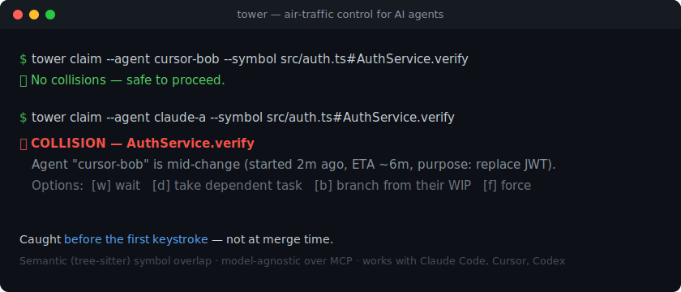

# Tower 🗼

[](https://github.com/Rohanxmalik/Tower/actions/workflows/ci.yml)

[](LICENSE)

**Air-traffic control for AI agents editing a shared repo.**

**[tower-mcp on npm](https://www.npmjs.com/package/tower-mcp)** · **[Website](https://rohanxmalik.github.io/Tower/)** · **[Docs](./docs)** — install: `npx -y tower-mcp serve`

Tower is an [MCP](https://modelcontextprotocol.io) server that stops two AI agents from
colliding on the same code. Any agent — Claude Code, Cursor, Codex, Gemini — registers
what it's _about to change_; Tower detects **semantic** overlap with other active agents
and warns **before** the edit happens, not at merge time.



```
⛔ COLLISION — AuthService.verify
   Agent "cursor-bob" is mid-change (started 2s ago, ETA ~6m, purpose: replace JWT).
   Options:  [w] wait   [d] take dependent task   [b] branch from their WIP   [f] force
```

> The banner above is an animated SVG. Prefer a real terminal-recording GIF? Run
> [`vhs`](https://github.com/charmbracelet/vhs): `vhs examples/two-agents-demo/demo.tape` → `docs/demo.gif`.

> Status: **early / building in public.** MVP works end-to-end. See [MVP-SPEC.md](./MVP-SPEC.md)
> for the full design and roadmap.

## Why

Memory, agent protocols (MCP/A2A), and observability dashboards are already solved. The
unowned gap is **write-side coordination** — as teams run many agents per repo in parallel,
the bottleneck becomes collisions and wasted work you only discover at merge. Tower is the
model-agnostic layer that prevents that. It sits _above_ git and _uses_ MCP; it doesn't
replace either.

## See it (5 seconds)

```bash
npm run demo
```

Two agents reach for the same symbol; the second is caught before its first keystroke.
Turn it into a GIF with [`vhs`](https://github.com/charmbracelet/vhs):
`vhs examples/two-agents-demo/demo.tape`.

## Quickstart

Needs **Node 22+** (uses built-in `node:sqlite`, no native build). Add Tower to your
agent's MCP config:

```jsonc
// Claude Code — .mcp.json
{
  "mcpServers": {
    "tower": { "command": "npx", "args": ["-y", "tower-mcp", "serve"] },
  },
}
```

Or drive it from the terminal:

```bash
npx -y tower-mcp init      # writes .tower/policy.yaml + prints MCP setup
npx -y tower-mcp serve     # MCP over stdio (or: serve --http --port 4319 --token <secret>)
```

<details><summary>From source (contributors)</summary>

```bash
git clone https://github.com/Rohanxmalik/Tower && cd Tower
npm install && npm run build
node packages/cli/dist/index.js serve
```

</details>

Then add to your agent's rules file:

> "Before editing any file, call `claim_intent` with the files and symbols you'll change.
> If a `hard` conflict returns, stop and ask the user."

Full setup → [docs/quickstart.md](./docs/quickstart.md).

## The 9 tools

| Tool                               | Purpose                                                      |
| ---------------------------------- | ------------------------------------------------------------ |
| `claim_intent`                     | Register intent **and** get collisions in one call (primary) |
| `check_collision`                  | Dry-run collision check, no claim persisted                  |
| `heartbeat`                        | Keep a claim alive (auto-expires otherwise)                  |
| `complete_claim` / `release_claim` | Free a claim on commit / abandon                             |
| `list_claims`                      | Live claim state                                             |
| `log_decision` / `get_decisions`   | Shared architecture-decision memory                          |
| `next_task`                        | Rule-based sequencer: a module that's safe to start now      |

Wire contract → [docs/protocol.md](./docs/protocol.md).

## How it works

```
MCP clients (Claude Code / Cursor / Codex)
        │  stdio  ·  HTTP/SSE
        ▼
Tower server ── collision engine (tree-sitter symbols) · sequencer · SQLite store
        ▲
tower CLI: init · serve · status · watch · claim · guard · complete   (+ git & PreToolUse hooks)
```

- **Semantic, not textual:** symbols come from tree-sitter ASTs (TS/JS/Python), so
  `AuthService.verify` collides even across different diff hunks.
- **Model-agnostic:** it's an MCP server — every major agent works today.

## Enforcement (don't rely on the agent remembering)

A tool call the agent _chooses_ to make isn't a safety net. The **Claude Code PreToolUse
hook** makes it one: before any `Edit`/`Write`, Tower checks the file, and if another
active agent holds a hard-conflicting claim the edit is **blocked** and the reason is fed
back to Claude.

```bash
npm run build
cp .claude/settings.example.json .claude/settings.json   # then reload Claude Code
```

Open two agent sessions on the same repo → the second is blocked when it reaches for a
file the first is editing. Details + scope → [docs/enforcement.md](./docs/enforcement.md).

## Team mode (whole team, different machines)

Point everyone's agents — Claude, Cursor, Codex — at **one** Tower with a permanent URL.
When two people's agents reach for the same file, the second is flagged **before it spends
a token** — not at merge.

Deploy your own in ~2 minutes (free tiers available), no tunnels:

[](https://render.com/deploy?repo=https://github.com/Rohanxmalik/Tower)

Or self-manage with Docker:

```bash
TOWER_TOKEN=your-secret docker compose up -d   # http://<host>:4319/mcp
```

Each dev's `.mcp.json` uses `"type": "http", "url": ".../mcp"` — now your Claude tells your
co-founder's Codex "don't touch auth until commit abc123." Full setup (Render/Railway/Fly +
per-editor config) → [docs/team.md](./docs/team.md).

> 🚀 **Don't want to host it?** [Tower Cloud](https://rohanxmalik.github.io/Tower/#cloud) —
> a managed, always-on coordination server for teams — is coming. Join the waitlist.

## Monorepo layout

```
packages/shared   protocol types + zod schemas (source of truth)
packages/server   collision engine, sequencer, SQLite store, MCP server, transports
packages/cli      the `tower` command
hooks/            Claude Code PreToolUse enforcement hook
examples/         two-agents-demo, git-hooks
docs/             quickstart, protocol, enforcement, team
Dockerfile        hosted team server
```

## Develop

```bash
npm install
npm test          # vitest, 80% coverage gate
npm run build     # tsc -b
```

## Roadmap

- Predictive conflict detection (ML on your merge history) — the eventual moat
- Auto-resolution / reconciliation agent
- Cross-repo / org-wide intent graph + API-contract break detection
- Enterprise: policy engine, SSO, audit ledger
- A2A adapter for cross-vendor agent delegation

## License

MIT
