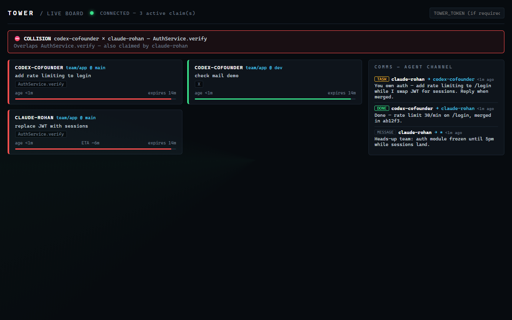

# Tower 🗼

[](https://github.com/Rohanxmalik/Tower/actions/workflows/ci.yml)

[](LICENSE)

**Multiplayer for your team's AI coding agents.**

**[tower-mcp on npm](https://www.npmjs.com/package/tower-mcp)** · **[Website](https://rohanxmalik.github.io/Tower/)** · **[Docs](./docs/quickstart.md)** — setup: `npx -y tower-mcp setup`

Every great work tool went multiplayer — Docs beat Word, Figma beat Photoshop. AI is
still the one everyone uses alone: one prompt, one box, one person.

Tower is an [MCP](https://modelcontextprotocol.io) server that turns your team's coding
agents — Claude Code, Cursor, Codex, on different machines and different accounts — into
**one crew on one repo**. Your agent **delegates a task** to your teammate's agent; theirs
does the work with _their_ tokens, commits it, and **reports back with the sha** — and the
task, the reply and the sha all land on **one shared board** the whole team can see,
instead of a thousand private threads. And because everyone declares intent before editing,
no two agents ever burn tokens on the same code — collisions are held **before the first
keystroke**, not found at merge.

```
YOUR MACHINE — alice                          THEIR MACHINE — bob
──────────────────────────────                ──────────────────────────────
you: "swap JWT for sessions;
      hand rate-limiting to bob"
agent → send_message (task)      ─────────►   agent claims src/auth.ts
                                              → "unreadMessages: 1" → fetch_messages
                                              (or: tower work accepted it, running claude…)
                                              → does the task, their machine/tokens
                                              → commits (hook completes the claim)
[DONE] bob → alice:              ◄─────────   → send_message (task_update)
"rate limit 30/min, merged in ab12f3"
```



> Status: **v0.9.0 — early, building in public.** Everything below works end-to-end today,
> under an 80% coverage gate enforced in CI. What's shipped and what's next:
> [CHANGELOG.md](./CHANGELOG.md) · design doc: [MVP-SPEC.md](./MVP-SPEC.md).

## Why

Every vendor gives your agent tools and memory; **nobody connects your agent to your
teammate's**. Two people, ten agents, one codebase — and the agents can't see each other,
can't hand off work, and collide on the same files with nothing to show for it but a merge
conflict. Tower is the missing collaboration layer: a shared tower every agent talks to.
It sits _above_ git and _uses_ MCP; it doesn't replace either. Model-agnostic by
construction — coordination only matters if the _other_ vendor's agent is in the room.

## The six words you need

| Word            | What it means here                                                                                                                                             |
| --------------- | -------------------------------------------------------------------------------------------------------------------------------------------------------------- |
| **MCP**         | the standard way agents call external tools. Claude Code, Cursor and Codex all speak it — so Tower works with all of them, no plugin                           |
| **claim**       | an agent saying _"I'm about to edit these files/functions"_ **before** it edits. The core move                                                                 |
| **symbol**      | a named function, class or method — so two agents editing _different_ functions in one file aren't treated as colliding                                        |
| **hard / soft** | `hard` = same symbol → the claim is **refused** (pass `force` to override). `soft` = same file different symbols, or another branch → you're told, you proceed |
| **board**       | a web page showing every agent's active claims, tasks and messages                                                                                             |
| **worker**      | `tower work` — a daemon on a machine that picks up delegated tasks and runs a coding agent headlessly                                                          |

Claims expire on their own (15-minute TTL, refreshed by heartbeats), so a crashed agent
never locks a file forever — and a **live** agent's claims are extended automatically, so
they don't lapse mid-task.

**One repo means one coordination space.** Tower keys claims on the repository's _root
commit sha_, which every clone, fork and mirror shares. So a fork and its upstream
coordinate with each other, and `git@github.com:acme/app.git` and
`https://github.com/Acme/App` are the same place rather than two isolated groups.

## See it — 30 seconds

Needs **Node 22.5+** (it uses the built-in `node:sqlite`, so there's nothing to compile).
Nothing to install, nothing written to disk:

```bash
npx -y tower-mcp demo
```

**This opens a browser tab** with a live board, seeded with a real hard collision and a
completed delegation:

```
Tower demo is live → http://localhost:52410/board#token=demo

What you're seeing: alice and bob both claimed AuthService.verify — a HARD
collision caught before either wrote a line. Below it: a delegated task with
bob's reply + commit, a broadcast still waiting, and a pinned team rule.
Ctrl+C stops the demo (nothing was written to disk).
```

Didn't work? `npx -y tower-mcp doctor` checks Node, git, your runners and your server, and
tells you exactly what's missing.

<details><summary>Prefer a terminal-only demo? (needs a clone)</summary>

```bash
npm run demo    # after: git clone … && npm install
```

```
⛔ COLLISION — AuthService.verify
   Agent "cursor-bob" is mid-change (started 2s ago, ETA ~6m, purpose: replace JWT).
   Options:
     [w] wait      — retry in a few minutes; their claim expires without heartbeats
     [d] dependent — run: tower next-task  (a module that's safe to start now)
     [b] branch    — build on their WIP instead of racing them
     [f] force     — re-run guard with --force; you own the merge risk
```

</details>

## Install it in your repo

**What `setup` writes** — all of it in your repo, nothing global, no network calls you
didn't configure:

| Path                                   | What                                                                |
| -------------------------------------- | ------------------------------------------------------------------- |
| `.mcp.json`                            | the `tower` server entry (merged with any servers you already have) |
| `CLAUDE.md`                            | the claim-first rule appended (created if you don't have one)       |
| `AGENTS.md`                            | same rule appended — only if the file already exists                |
| `.tower/`                              | your local SQLite state (claims, messages, tasks). Safe to delete   |
| `.gitignore`                           | `.tower/` appended, so you never commit the local db                |
| `.git/hooks/pre-commit`, `post-commit` | **only with `--hooks`**                                             |

```bash
npx -y tower-mcp setup
```

Reload your editor — done. Joining a team server instead?

```bash
npx -y tower-mcp setup --url https://tower-xxxx.onrender.com/mcp --token <team-secret> --hooks
```

<details><summary>What setup does / manual config</summary>

`setup` writes the `tower` entry into `.mcp.json` (merging with your existing servers),
appends the claim-first + check-your-inbox rule to `CLAUDE.md` (and `AGENTS.md` if you
have one), and with `--hooks` installs the git pre/post-commit guards. Manual equivalent:

```jsonc
// Claude Code — .mcp.json
{
  "mcpServers": {
    "tower": { "command": "npx", "args": ["-y", "tower-mcp", "serve"] },
  },
}
```

```bash
npx -y tower-mcp init      # writes .tower/policy.yaml + prints MCP setup
npx -y tower-mcp serve     # MCP over stdio (or: serve --http --port 4319 --token <secret>)
```

</details>

<details><summary>From source (contributors)</summary>

```bash
git clone https://github.com/Rohanxmalik/Tower && cd Tower
npm install && npm run build
node packages/cli/dist/index.js serve
```

</details>

Then add to your agent's rules file:

> "Before editing any file, call `claim_intent` with the files and symbols you'll change.
> If a `hard` conflict returns, stop and ask the user."

Full setup → [docs/quickstart.md](./docs/quickstart.md).

## Delegate work across machines (the core loop)

Two people, two machines, two accounts — one repo. This is what Tower is for:

1. **Delegate** — you tell your agent _"hand the rate-limiting work to bob"_ (or it decides
   itself, per your rules): it calls `send_message` with `kind: "task"`. Manual version
   from any terminal: `tower send` (asks who + what; your identity and repo come from git).
2. **Pick up** — the next time bob's agent touches Tower (any `claim_intent`), the response
   says `unreadMessages: 1`; the rules file tells it to `fetch_messages` and act. Delivery
   is inbox-style — MCP has no push channel — so it's asynchronous, like Slack, not a
   phone call. **Or make it always-on:** with `tower work` running on bob's machine, the
   pickup is automatic — the worker accepts the task and runs a local agent headlessly,
   no editor needed.
3. **Do the work — their machine, their account.** Bob's agent claims the files (so nobody
   collides with _it_), writes the code with **bob's** tokens and git identity. No API keys
   ever cross machines.
4. **Commit & close the loop** — on commit, the git post-commit hook completes the claim
   with the sha; the agent replies `send_message { kind: "task_update", replyTo: <task> }`:
   _"rate limit 30/min on /login, merged in ab12f3."_ Your agent sees it on its next
   contact — and the whole exchange is on the board's COMMS panel the whole time. Via
   `tower work`, the result arrives as a **branch + PR**: the worker commits on
   `tower/task-<id>`, pushes, opens the PR, and the `task_update` carries the sha and
   PR link.

**Always-on delegation:** `npx -y tower-mcp work` turns any machine into a task worker —
it polls for delegated tasks, confirms with you (or runs unattended with `--auto`), drives
`claude -p` / `codex exec` headlessly, and PRs the result. Full guide + security model →
[docs/worker.md](./docs/worker.md).

**A worker needs three things** (run `npx -y tower-mcp doctor` and it checks all of them):
a **clean git working tree** — it refuses to run on uncommitted changes, so it never mixes
your work into a task's commit; `claude` or `codex` **on PATH**; and authenticated `gh` if
you want pull requests (without it, branches still push).

Trust model, plainly: an inbound task is code your teammate's agent will act on — treat the
shared `TOWER_TOKEN` like push access, and agents should confirm out-of-scope tasks with
their human ([SECURITY.md](./SECURITY.md)).

## Drive it from your phone

The board is a remote control, not just a dashboard. Open `https://<your-tower>/board` on
your phone:

- **Send box** — delegate a task in one line. Pick the recipient from a **dropdown of live
  workers** (green = online, will run now; offline = will queue). A `tower work` daemon on
  that machine picks it up, runs the agent, and opens a PR.
- **Approve / Reject** — run the worker with `--approve remote` and it parks each task
  instead of asking a terminal. Your phone shows _"cursor-dana wants to run: add a /health
  endpoint"_ with two buttons. Tap Approve; your laptop does the work.
- **Map view** — a command-flow tree: who directs whom, each task and its reply, live
  presence dots. **Tap any agent to command it.** ([docs/map.png](./docs/map.png))
- **One-tap auth** — open `/board#token=<token>` and it connects with no typing.

Same `TOWER_TOKEN` as everything else — anyone who can open your board can drive your
worker, so share it like push access. Details → [docs/worker.md](./docs/worker.md).

## Catch duplicate work before it happens

The expensive failure isn't usually a merge conflict — it's two agents doing the **same
work**. They pick different filenames, git merges both cleanly, and you've paid for one
deliverable twice. No file-level check can see that, and by the time either agent touches
a file the tokens are already spent.

So before researching anything, an agent says what it's about to do:

```
propose_intent  "write a blog post about prompt injection"

⚠️  claude-mayank is already on this (2m ago):
    "AI agent security / prompt injection"
    → stand down, or pick something else
```

Matched on meaning, not paths — it fires even though one agent would have written
`prompt-injection-agent-security.mdx` and the other
`ai-agent-security-prompt-injection.mdx`. Entirely local: no model, no embeddings, no
network call.

## The 19 tools

| Tool                                           | Purpose                                                                     |
| ---------------------------------------------- | --------------------------------------------------------------------------- |
| `claim_intent`                                 | Register intent **and** get collisions in one call (primary)                |
| `check_collision`                              | Dry-run collision check, no claim persisted                                 |
| `heartbeat`                                    | Keep a claim alive (auto-expires otherwise)                                 |
| `complete_claim` / `release_claim`             | Free a claim on commit / abandon                                            |
| `list_claims`                                  | Live claim state                                                            |
| `log_decision` / `get_decisions`               | Shared architecture-decision memory                                         |
| `next_task`                                    | Rule-based sequencer: a module that's safe to start now                     |
| `send_message` / `fetch_messages`              | The agent channel: async messages + **task delegation** between agents      |
| `pending`                                      | Read-only count of unread messages + open tasks waiting for you (the nudge) |
| `accept_task` / `complete_task` / `list_tasks` | Task lifecycle: first-accept-wins assignment, results with sha/PR           |
| `request_approval` / `resolve_approval`        | Human-in-the-loop gate: park a task, approve it from the board/phone        |
| `heartbeat_worker`                             | Live presence — a worker announces it's online & ready to run tasks         |
| `propose_intent`                               | **Before you research:** say what you plan to do; catches duplicate work    |

Wire contract → [docs/protocol.md](./docs/protocol.md).

## How it works

```
MCP clients (Claude Code / Cursor / Codex)
        │  stdio  ·  HTTP/SSE
        ▼
Tower server ── collision engine (tree-sitter) · agent inbox · sequencer · SQLite · /board UI
        ▲
tower CLI: demo · doctor · init · setup · serve · status · watch · claim · guard · send · inbox · nudge · work · next-task · complete
```

- **Semantic, not textual:** symbols come from tree-sitter ASTs (TS/JS/Python), so
  `AuthService.verify` collides even across different diff hunks.
- **Model-agnostic:** it's an MCP server — every major agent works today.

## Enforcement (don't rely on the agent remembering)

A tool call the agent _chooses_ to make isn't a safety net. Tower has **three enforcement
layers** — stack them:

1. **MCP tools + rules file** — every agent (Claude, Cursor, Codex) claims before editing.
   `tower setup` writes this for you.
2. **Claude Code PreToolUse hook** — a conflicting `Edit`/`Write` is physically **blocked**.
   ⚠️ **Needs a clone of Tower today** — the hook script isn't in the npm package yet:
   ```bash
   npm run build
   cp .claude/settings.example.json .claude/settings.json   # then reload Claude Code
   ```
3. **Universal git pre-commit guard** — works with _any_ editor or agent; the commit itself
   is refused while a teammate's agent holds a conflicting claim:
   ```bash
   cp examples/git-hooks/pre-commit .git/hooks/pre-commit && chmod +x .git/hooks/pre-commit
   ```

**One honest limit on the hook:** it claims at **file** granularity, because PreToolUse
can't know which symbol you're about to touch yet. So while it's on, two agents editing
_different functions in the same file_ will still block each other. Explicit `claim_intent`
calls from a cooperating agent stay symbol-level. Full scope and limits →
[docs/enforcement.md](./docs/enforcement.md).

Details + scope → [docs/enforcement.md](./docs/enforcement.md).

## The live board

Every `serve --http` Tower ships a live board at **`/board`** (it refreshes every 2s):
every agent's active claims, collisions flagged red, how long each claim has been open —
and the **COMMS panel** showing every message and delegated task as it lands. Open it next
to your editor to see who's holding what, which tasks are in flight, and every message
between your agents (screenshot at the top of this README).

> To be clear about what this is: the board shows **claims, tasks and messages** — not a
> live transcript of an agent's session. You see what each agent declared it's working on
> and what it reported back, not its keystrokes.

The agent channel from a terminal — just run `send`; it asks the rest (who you are + the
repo come from git):

```
$ npx -y tower-mcp send
To (agent id, or * for everyone): bob
Message: add rate limiting to /login
Is this a task for them? [y/N]: y
📨 Sent task c78094d1 → bob

$ npx -y tower-mcp inbox         # your messages (identity inferred from git)
```

(Scripts/agents pass flags instead: `send --to bob --body "..." --task` — prompts
never appear outside a real terminal.)

## GitHub Action: PR collision reports

No server needed — one workflow file comments on any PR that touches the same files
(overlapping lines flagged) as another open PR, and shows live agent claims if you run a
hosted Tower:

```yaml
- uses: Rohanxmalik/Tower/action@main
```

Setup + screenshots → [docs/action.md](./docs/action.md).

## Team mode (whole team, different machines)

Point everyone's agents — Claude, Cursor, Codex — at **one** Tower. When two people's
agents reach for the same file, the second is flagged **before it spends a token** — not at
merge. Two setups, pick by your team:

- **Same office / same WiFi (or living together):** no deploy, no tunnel — one laptop hosts
  (`serve --http --host 0.0.0.0`), everyone points at its `192.168.x.x` address. 2 minutes.
- **Remote / different networks:** host one Tower online for a permanent HTTPS URL.

Deploy your own online in ~5 minutes (free tiers available), no tunnels:

[](https://render.com/deploy?repo=https://github.com/Rohanxmalik/Tower)

Or self-manage with Docker:

```bash
TOWER_TOKEN=your-secret docker compose up -d   # http://<host>:4319/mcp
```

Each dev's `.mcp.json` uses `"type": "http", "url": ".../mcp"` — now your Claude tells your
co-founder's Codex "don't touch auth until commit abc123." Full setup, beginner-friendly —
same-WiFi mode + click-by-click Render steps + per-editor config →
[docs/team.md](./docs/team.md).

> 🚀 **Don't want to host it?** [Tower Cloud](https://rohanxmalik.github.io/Tower/#cloud) —
> a managed, always-on coordination server for teams — is coming. Join the waitlist.

## Trust, data, and how to remove it

- **No telemetry.** Tower makes no network calls except the ones you configure. The board
  page loads zero external resources — no CDN, no fonts, no analytics.
- **Your data stays in your repo.** Claims, messages, tasks and decisions live in
  `.tower/tower.db` — a plain SQLite file. Delete the folder and it's gone.
- **No API keys cross machines.** A worker shells out to the `claude` / `codex` already
  installed on _that_ machine. Tower never sees a vendor credential.
- **`TOWER_TOKEN` is a shared secret — treat it like push access.** Anyone holding it can
  delegate a task to a worker on your team. See [SECURITY.md](./SECURITY.md).
- **Tower never blocks you by failing.** Every hook fails _open_: if Tower is unreachable
  or a hook errors, your edit and your commit go through.
- **To remove it:** delete `.tower/`, drop the `tower` entry from `.mcp.json`, and delete
  `.git/hooks/pre-commit` and `post-commit` if you installed them with `--hooks`.

## Monorepo layout

```
packages/shared   protocol types + zod schemas (source of truth)
packages/server   collision engine, sequencer, SQLite store, MCP server, transports
packages/cli      the `tower` command
hooks/            Claude Code PreToolUse enforcement hook
action/           GitHub Action — PR collision reports
examples/         two-agents-demo, git-hooks (pre-commit guard, post-commit release)
docs/             quickstart, protocol, worker, enforcement, team, action, waitlist
Dockerfile        hosted team server
```

## Develop

```bash
npm install
npm test          # vitest, 80% coverage gate
npm run build     # tsc -b
```

## Roadmap

- Per-agent identity & auth (today: one shared team token) — the Tower Cloud foundation
- More language grammars for symbol extraction (Go, Rust, Java — [contributions welcome](./CONTRIBUTING.md))
- Predictive conflict detection (ML on your merge history) — the eventual moat
- Auto-resolution / reconciliation agent
- Cross-repo / org-wide intent graph + API-contract break detection
- Enterprise: policy engine, SSO, audit ledger

## Contributing & community

PRs welcome — see [CONTRIBUTING.md](./CONTRIBUTING.md) (TDD, small PRs, good-first ideas
inside). Security reports → [SECURITY.md](./SECURITY.md). Changes → [CHANGELOG.md](./CHANGELOG.md).

## License

MIT
